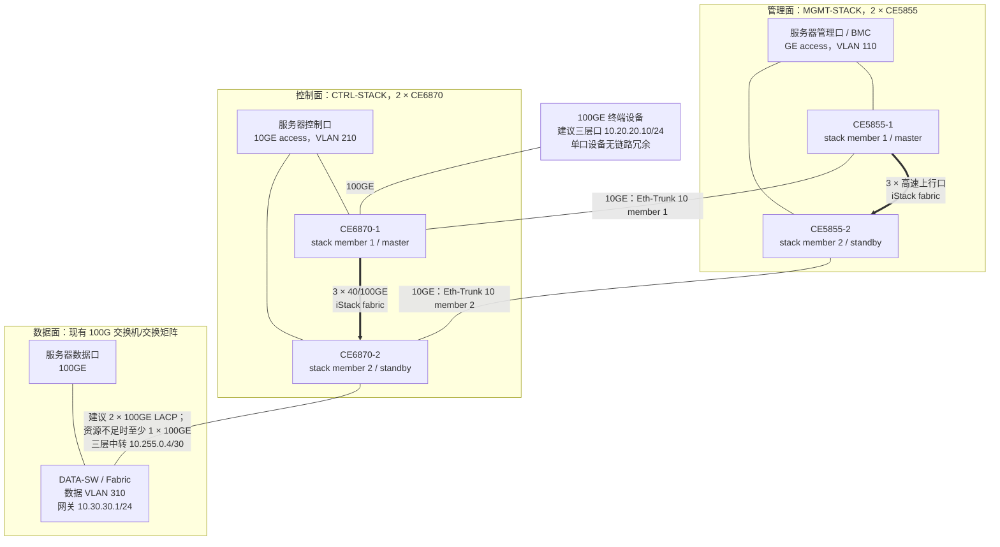

# CE6870 / CE5855 集群三平面组网与配置方案

> 适用场景：集群划分为管理面（GE）、控制面（10GE）和数据面（100GE）；管理面、控制面各由两台交换机扩容；控制面另有一个 100GE 终端需要访问三个平面。
>
> **本文是实施模板，不是可直接粘贴的最终配置。** CE5855、CE6870均有多个子型号，端口类型、端口编号、堆叠许可和命令随 VRP 版本变化。实施前必须记录完整型号、VRP 版本、补丁、光模块/DAC 型号，并在对应版本的华为产品文档中复核命令。

## 1. 结论与设计边界

### 1.1 推荐结论

1. 两台 CE5855 组成一个管理面 iStack，两台 CE6870 组成一个控制面 iStack。每组用 3 个上行物理口承载堆叠，形成一台逻辑交换机，解决端口不足并简化跨成员链路聚合。
2. 管理面与控制面采用 **两条跨成员物理链路 + 一个 LACP Eth-Trunk + 三层 /30 互联**，不把全部广播域直接拉通。
3. 控制面与 100G 数据交换机采用独立三层互联。数据交换机型号、数量尚未提供，所以本文只给对端通用模板。
4. 100GE 终端默认使用一个普通三层接入口（或单业务 VLAN access 口），由 CE6870 路由到管理、控制、数据网；只有终端确实需要多个二层广播域并支持 802.1Q 子接口时，才改成白名单 VLAN trunk。
5. 三平面互通必须受 ACL/防火墙控制。“可达所有网络”不等于“任意端口双向放通”。管理面只允许堡垒机、监控、SSH/SNMP/NTP 等必要流量。

### 1.2 不能直接确定的事项

- “CE5855”和“CE6870”不是完整料号。必须确认类似 `CE5855-48T4S2Q-EI`、`CE6870-48S6CQ-EI` 的完整型号。
- CE5855 的高速上行可能是 10GE/40GE，CE6870 的 QSFP 口可能工作在 40GE 或 100GE；三根线两端必须同速、同介质。
- 若现网设备/版本不支持目标堆叠方式，采用第 9 节的 M-LAG 备选方案，不能把三根并行链路当普通 trunk 接上，否则会产生二层环路。
- 数据面交换机、网段、网关位置、终端操作系统和安全策略未给出。本文使用示例地址，割接前必须替换。

## 2. 推荐组网图



> 图中的服务器双接只是推荐。服务器若双接同一逻辑堆叠，可在主机侧做 LACP bond；若不能做 LACP，则采用 active-backup。禁止让两块网卡独立桥接同一 VLAN。

## 3. 地址、VLAN 与路由规划（示例）

| 用途 | VLAN | IPv4 网段 | 网关位置 | 说明 |
| --- | ---: | --- | --- | --- |
| 设备带外管理 | 无/OOB | `10.99.0.0/24` | 独立 OOB 网络 | 推荐使用交换机 `MEth`，不承载业务 |
| 服务器管理面 | 110 | `10.10.10.0/24` | CE5855 `Vlanif110`：`10.10.10.1` | BMC、OS 管理、监控 |
| 服务器控制面 | 210 | `10.20.20.0/24` | CE6870 `Vlanif210`：`10.20.20.1` | 集群控制流量 |
| 服务器数据面 | 310 | `10.30.30.0/24` | DATA-SW：`10.30.30.1` | 高带宽业务流量 |
| 管理—控制互联 | 3900 | `10.255.0.0/30` | CE5855 `.1`，CE6870 `.2` | 仅两台逻辑交换机使用 |
| 控制—数据互联 | 3901 | `10.255.0.4/30` | CE6870 `.5`，DATA-SW `.6` | 可换成物理三层口 |

推荐先用静态路由，拓扑简单、故障域清晰。后续若网段很多或存在多出口，再在三台逻辑设备之间启用 OSPF，并对路由发布做前缀过滤。

路由关系：

- CE5855：`10.20.20.0/24`、`10.30.30.0/24` 下一跳 `10.255.0.2`。
- CE6870：`10.10.10.0/24` 下一跳 `10.255.0.1`；`10.30.30.0/24` 下一跳 `10.255.0.6`。
- DATA-SW：`10.10.10.0/24`、`10.20.20.0/24` 下一跳 `10.255.0.5`。
- 100GE 终端：地址 `10.20.20.10/24`，默认网关 `10.20.20.1`。这样一个普通三层口即可访问三个网段，无需把三个 VLAN 延伸到终端。

## 4. 物理端口与布线表

实施时用真实端口替换 `<...>`。三根堆叠线尽量分散到不同端口组，链路等长且使用同规格模块。

| 本端 | 端口（占位） | 对端 | 端口（占位） | 用途 |
| --- | --- | --- | --- | --- |
| CE5855-1 | `<STACK-A1/A2/A3>` | CE5855-2 | `<STACK-B1/B2/B3>` | 管理堆叠，3 链路 |
| CE6870-1 | `<STACK-A1/A2/A3>` | CE6870-2 | `<STACK-B1/B2/B3>` | 控制堆叠，3 链路 |
| CE5855 member 1 | `<M-C-1>` | CE6870 member 1 | `<C-M-1>` | Eth-Trunk 10 成员 1 |
| CE5855 member 2 | `<M-C-2>` | CE6870 member 2 | `<C-M-2>` | Eth-Trunk 10 成员 2 |
| CE6870 member 1 | `<TERM-100G>` | 终端 | `<NIC-100G>` | 终端单链路 |
| CE6870 member 1/2 | `<DATA-1/2>` | DATA-SW | `<CTRL-1/2>` | 推荐 Eth-Trunk 20 |

**接线顺序：**先断电完成堆叠布线并核对收发方向，再上电形成堆叠；业务互联线最后接。不要在两台尚未形成堆叠的交换机之间同时接入多条二层业务线。

## 5. iStack 实施方法

### 5.1 上线前检查

在每台交换机分别执行并留档：

```text
display device
display version
display patch-information
display license
display interface brief
display transceiver interface <interface> verbose
display current-configuration
```

要求：同组设备型号兼容、VRP 大版本和补丁一致、堆叠能力/许可满足要求、成员 ID 不冲突。备份配置并安排维护窗口；组堆叠通常会重启，现网流量会中断。

### 5.2 逻辑规划

- 设备 1：member ID 1，priority 150，预期 master。
- 设备 2：member ID 2，priority 100，预期 standby。
- 三个物理口加入堆叠逻辑口。若版本要求两个 `stack-port` 才能构成冗余拓扑，按该版本硬件指南把链路分配为 `2+1`，不要凭模板猜测。
- 保存配置，按官方版本手册要求下电接线/重启，然后检查堆叠状态。

堆叠命令骨架如下，**尖括号内容必须从对应型号/版本命令参考替换**：

```text
system-view
sysname <MGMT-1-or-MGMT-2>
stack
 stack member <old-id> renumber <1-or-2>
 stack member <1-or-2> priority <150-or-100>
quit

# 不同 VRP 版本可能需要先将物理口切换为 stack 模式，随后加入 stack-port：
interface <physical-stack-interface>
 port mode stack
quit
interface stack-port <member-id>/<stack-port-id>
 port member-group interface <physical-stack-interface>
quit

save
```

CE6870 重复同样过程，但必须按完整型号确认 40/100GE 口模式。禁止在不确认版本语法时批量粘贴。

### 5.3 堆叠验收

```text
display stack
display stack topology
display stack port
display interface brief
display alarm active
```

必须看到两个成员、角色正常、所有计划中的堆叠链路 Up，且没有版本不一致或分裂告警。完成后分别拔掉一根堆叠线验证仍可转发，再恢复；不可一次拔多根。

## 6. 业务配置模板

以下为常见 VRP V200 风格示例。执行前先在实验设备或维护窗口使用 `?` 校验命令。

### 6.1 CE5855 管理堆叠

```text
system-view
sysname MGMT-STACK
vlan batch 110 3900

interface Vlanif110
 description MGMT-GATEWAY
 ip address 10.10.10.1 255.255.255.0
quit

interface Eth-Trunk10
 description TO-CTRL-STACK
 mode lacp-static
 port link-type trunk
 port trunk allow-pass vlan 3900
quit
interface <member-1-to-control>
 eth-trunk 10
quit
interface <member-2-to-control>
 eth-trunk 10
quit

interface Vlanif3900
 description L3-TO-CTRL-STACK
 ip address 10.255.0.1 255.255.255.252
quit

interface <server-mgmt-ge-port-range>
 port link-type access
 port default vlan 110
 stp edged-port enable
quit

ip route-static 10.20.20.0 255.255.255.0 10.255.0.2
ip route-static 10.30.30.0 255.255.255.0 10.255.0.2
save
```

### 6.2 CE6870 控制堆叠

```text
system-view
sysname CTRL-STACK
vlan batch 210 3900 3901

interface Vlanif210
 description CONTROL-GATEWAY
 ip address 10.20.20.1 255.255.255.0
quit

interface Eth-Trunk10
 description TO-MGMT-STACK
 mode lacp-static
 port link-type trunk
 port trunk allow-pass vlan 3900
quit
interface <member-1-to-mgmt>
 eth-trunk 10
quit
interface <member-2-to-mgmt>
 eth-trunk 10
quit
interface Vlanif3900
 description L3-TO-MGMT-STACK
 ip address 10.255.0.2 255.255.255.252
quit

interface Eth-Trunk20
 description TO-DATA-SW
 mode lacp-static
 port link-type trunk
 port trunk allow-pass vlan 3901
quit
interface <member-1-to-data>
 eth-trunk 20
quit
interface <member-2-to-data>
 eth-trunk 20
quit
interface Vlanif3901
 description L3-TO-DATA-SW
 ip address 10.255.0.5 255.255.255.252
quit

interface <server-control-10ge-port-range>
 port link-type access
 port default vlan 210
 stp edged-port enable
quit

# 推荐：终端使用控制网地址，通过三层路由访问其它平面
interface <terminal-100ge-port>
 description 100G-TERMINAL
 port link-type access
 port default vlan 210
 stp edged-port enable
quit

ip route-static 10.10.10.0 255.255.255.0 10.255.0.1
ip route-static 10.30.30.0 255.255.255.0 10.255.0.6
save
```

### 6.3 DATA-SW 通用对端

```text
system-view
vlan batch 310 3901
interface Vlanif310
 ip address 10.30.30.1 255.255.255.0
quit
interface Eth-Trunk20
 mode lacp-static
 port link-type trunk
 port trunk allow-pass vlan 3901
quit
interface <data-member-port-1>
 eth-trunk 20
quit
interface <data-member-port-2>
 eth-trunk 20
quit
interface Vlanif3901
 ip address 10.255.0.6 255.255.255.252
quit
ip route-static 10.10.10.0 255.255.255.0 10.255.0.5
ip route-static 10.20.20.0 255.255.255.0 10.255.0.5
save
```

若 DATA-SW 不支持堆叠/LACP 或只有一个可用端口，则把 Eth-Trunk 20 改成单链路 VLAN 3901；这时应明确记录该链路为单点故障。

## 7. 100GE 终端接入的两种方式

### 7.1 推荐：单网段接入 + 三层可达

终端配置：

```text
IP:      10.20.20.10/24
Gateway: 10.20.20.1
DNS:     按现网规划
MTU:     先统一 1500；只有端到端全部验证后才启用巨帧
```

优点是配置简单、广播域隔离清晰。交换机用路由把终端送往 `10.10.10.0/24` 与 `10.30.30.0/24`，满足“通所有网络”的三层需求。

### 7.2 可选：802.1Q trunk 到终端

仅当终端是虚拟化宿主机、路由器或安全设备，明确需要多个 VLAN 子接口时使用：

```text
interface <terminal-100ge-port>
 description 100G-TERMINAL-DOT1Q
 port link-type trunk
 port trunk allow-pass vlan 110 210 310
 stp edged-port enable
quit
```

同时必须在上游把 VLAN 110/310 正确延伸到 CE6870。**不要允许 `vlan all`**，不要把互联 VLAN 3900/3901、堆叠保留 VLAN 或缺省 VLAN 1 放给终端。此方式会扩大二层故障域，也可能让一个终端绕过三平面隔离，因此不是默认方案。

若终端只有一个 100GE 口，该口、光模块、光纤、CE6870 对应端口都属于单点。需要高可用时，为终端增加第二个 100GE 口，分别接到两个堆叠成员，并配置 LACP Eth-Trunk；不能只靠交换机堆叠消除终端侧单点。

## 8. 安全与运维基线

1. **ACL 最小授权：**以源、目的和端口列出矩阵；默认拒绝跨平面访问。先统计现网流量，再部署 ACL，避免误断集群心跳。
2. **设备管理：**SSH/SNMP/NTP/Syslog/AAA 只走 OOB 或 VLAN 110；禁用 Telnet、HTTP 和 SNMPv1/v2c（若网管平台允许，使用 SNMPv3）。
3. **二层保护：**服务器接入口启用边缘口；按版本能力配置 BPDU protection、风暴抑制和 MAC 地址数限制。互联口不能配置为边缘口。
4. **MTU：**先全网 1500。数据面如需 jumbo，必须同时核对终端、服务器 NIC、DATA-SW、CE6870 互联及中间所有子接口，并用 DF ping 验证。
5. **链路聚合：**两端都使用静态 LACP，成员速率、双工、MTU、VLAN 列表一致；不要混用手工负载分担与 LACP。
6. **配置管理：**每个阶段 `display current-configuration` 留档；验收后 `save`，并导出启动配置到配置库。

建议的最小跨平面策略：

| 源 | 目的 | 默认动作 | 例外 |
| --- | --- | --- | --- |
| 100GE 终端 `10.20.20.10` | 管理网 `10.10.10.0/24` | 拒绝 | 仅 SSH/HTTPS/SNMP/ICMP 等审批端口 |
| 控制网 | 管理网 | 拒绝 | 集群所需管理、监控、DNS/NTP |
| 管理网运维区 | 控制/数据网 | 拒绝 | 堡垒机到指定设备管理端口 |
| 数据网 | 管理网 | 拒绝 | 原则上无；确有回连按主机/端口放行 |

## 9. 不采用堆叠时的 M-LAG 备选

满足以下任一条件时考虑 M-LAG：堆叠距离/介质不满足、版本不兼容、不希望一次升级同时影响两台设备，或需要双控制平面故障隔离。

- 两台交换机独立运行，以 2 条链路组成 peer-link，另 1 条独立链路用于 keepalive（推荐走独立三层/OOB，不能与 peer-link 同一故障域）。
- 下联服务器/对端必须支持跨设备 LACP；接入口成对配置 M-LAG。
- M-LAG 的 peer-link、DFS group、双主检测、网关一致性与升级顺序强依赖 VRP 版本，必须按完整型号的官方示例实施。
- M-LAG 不是把 3 根线全部加入一个普通 Eth-Trunk。若没有完整设计与演练，优先选两机 iStack。

## 10. 割接与回退步骤

### 10.1 割接步骤

1. 冻结变更，导出现网配置、MAC/ARP/路由表、端口状态和监控基线。
2. 离线升级/统一同组设备 VRP 与补丁，核对堆叠许可和光模块兼容性。
3. 先组管理堆叠并验收，再组控制堆叠并验收；每组只接堆叠线，不接业务线。
4. 创建 VLAN、VLANIF、Eth-Trunk、静态路由和 ACL，但先 shutdown 新互联或暂不接线。
5. 接通管理—控制互联，验证 /30 邻接、LACP 成员与双向路由。
6. 接通控制—数据互联，验证三个网关互 ping 和路由表。
7. 分批迁移服务器：先管理口，再控制口，最后数据口。每批核对 MAC 学习、丢包和业务心跳。
8. 最后接入 100GE 终端，先验证网关，再按管理、控制、数据顺序验证允许的 TCP/UDP 服务。
9. 做单链路故障、单成员故障和主备倒换测试；确认业务收敛时间符合要求。
10. 保存配置、导出最终配置/端口表/标签表，更新监控与拓扑。

### 10.2 回退触发与动作

以下任一情况触发回退：堆叠反复分裂、关键业务连续丢包超过约定窗口、路由环路、ACL 无法在窗口内修正、光模块持续告警。

回退时停止继续迁移，shutdown 新互联，按端口表把已迁移链路恢复到原交换机，恢复割接前启动配置并逐项核对。不要在堆叠分裂状态下同时启用两侧业务上联，否则可能形成双主和二层环路。

## 11. 验收清单

```text
display stack
display stack topology
display stack port
display eth-trunk 10
display eth-trunk 20
display interface brief
display vlan
display ip interface brief
display ip routing-table
display arp
display mac-address
display stp brief
display alarm active
```

- [ ] 两个堆叠各有 2 个成员，角色、优先级、拓扑正常，3 条堆叠物理链路均 Up。
- [ ] Eth-Trunk 10/20 的 LACP 成员均 Selected，成员分布在两个 stack member 上。
- [ ] 三个业务网关可达，静态路由下一跳正确，无意外缺省路由和路由环路。
- [ ] 终端能访问审批的三个平面服务，不能访问未授权的管理端口。
- [ ] 单根堆叠线、单根业务互联线故障不影响业务；单交换机故障能够收敛。
- [ ] 端口无 CRC、丢包、错包和光功率告警；压力测试下无明显拥塞。
- [ ] MTU 1500（或规划值）端到端一致，DF ping 与实际业务传输通过。
- [ ] 最终配置已保存、备份，线缆/端口/机柜标签与文档一致。

## 12. 最终实施前必须补齐的信息

1. 四台设备的完整型号、ESN、VRP 版本、补丁和 license。
2. 三个平面的真实网段、网关、现有 VLAN ID、是否存在 VRF。
3. 数据面交换机的厂商、型号、数量和可用 100GE 端口。
4. 每组三个“上行口”的真实端口号、速率、模块/DAC/AOC 型号及距离。
5. 100GE 终端类型、是否支持 802.1Q/LACP、真实访问端口矩阵和是否需要双机冗余。
6. CE5855—CE6870 互联可用端口数量；若只有一条，应接受并记录单点风险。
7. 服务器是单接还是双接、bond 模式、LACP hash 策略以及允许的收敛时间。

这些信息补齐后，才能把本文中的占位符替换为逐台、逐端口可执行的最终配置。

## 13. 官方资料入口

- [华为 CE6870-48S6CQ-EI-A 支持与文档中心](https://support.huawei.com/enterprise/en/switches/ce6870-48s6cq-ei-a-pid-252551235)：按实际 VRP 版本下载 Hardware Description、Configuration Guide、Command Reference 和《How to Configure a Stack of CloudEngine Data Center Switches》。
- [华为数据中心网络设计指南：CE5800 Series](https://support.huawei.com/enterprise/en/doc/EDOC1100023542/e449c427)：用于核对 CE5855 系列典型下行/上行端口形态以及 stack、M-LAG 的部署能力。
- [华为 Info-Finder](https://info.support.huawei.com/info-finder/)：输入完整型号和 VRP 版本查询命令及特性约束。最终实施应以该设备对应版本返回的资料为准，而不是以本文的命令骨架代替产品手册。
